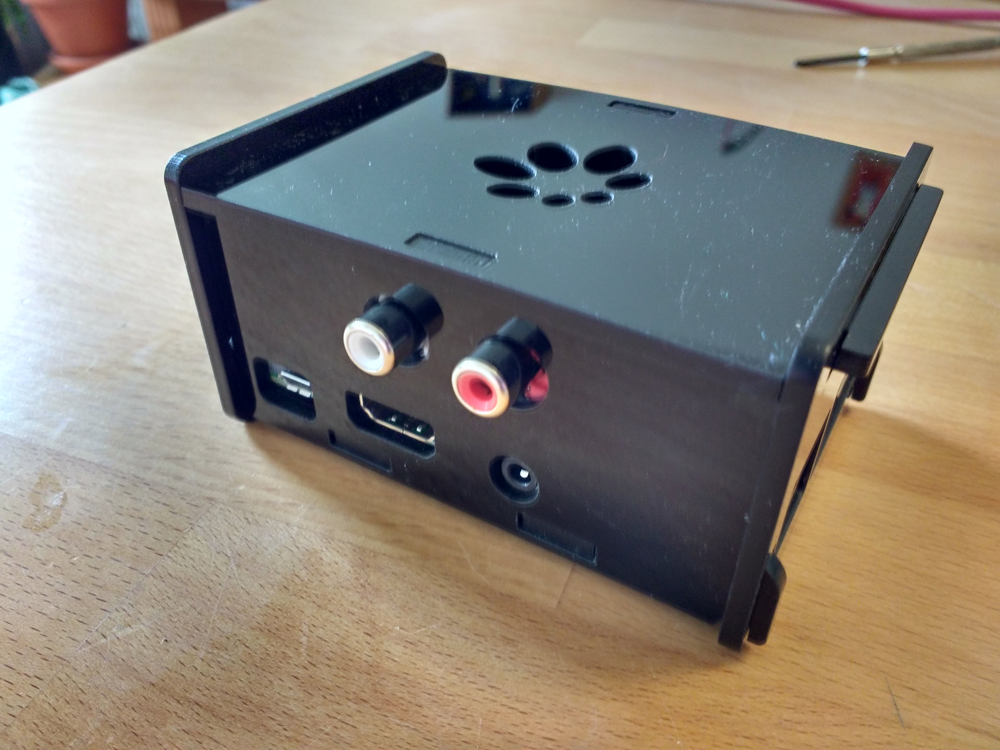
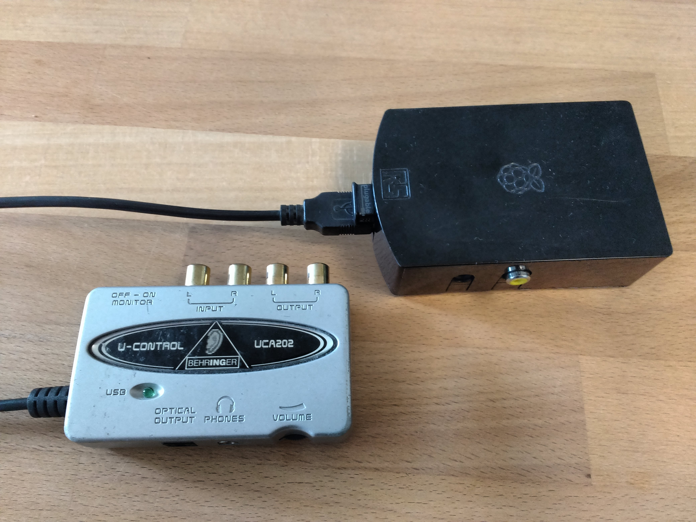

# Raspberry Pi Audio Streaming Box

This project explains how to setup a audio receiver box using a Raspberry Pi which allows to stream audio from

1. PulseAudio clients on the network or/and
1. a Bluetooth device (e.g. smartphone) via A2DP protocol

to your stereo hi-fi system.

Schematics:
```
+-------------------+                +-------------------------------+             +---------------------+
|                   | Local network  |               ||              |             |                     |
| PulseAudio Client | +------------> +               ||              |             |                     |
|                   |                |               ||              |             |                     |
+-------------------+                |               ||  HifiBerry   |             |                     |
                                     |  Raspberry Pi ||              | Cinch/SPDIF | Stereo Hi-Fi system |
+-------------------+                |               ||  or other    | +---------> |                     |
|                   | Bluetooth A2DP |               || sound output |             |                     |
|  Bluetooth Device | +------------> +               ||              |             |                     |
|                   |                |               ||              |             |                     |
+-------------------+                +-------------------------------+             +---------------------+
```



## Hardware

In the following guide we will use a Raspberry Pi 3 Model B and a HifiBerry DAC+ Light, but the instructions should work the same with differnt Raspberry Pi models starting from Raspberry Pi 1, with other HifiBerry modules, e.g. HifiBerry Digi+ with digital output or even with external USB sound devices. Because of the terrible sound quality of Raspberry's onboard sound, I would strongly recommend against using it for Hi-fi output. The instructions should still apply, though.

The following table shows the products I used and which can be ordered as a bundle from the [HifiBerry shop](https://www.hifiberry.com/shop/) from Switzerland.

| Article                                         	| Price   	  |
|-------------------------------------------------	|-----------	|
| Raspberry Pi 3 Model B                          	| € 31,90    	|
| HifiBerry DAC+ Light                            	| € 19,90  	  |
| HifiBerry universal case                        	| € 9,90   	  |
| MicroSD card 8GB, class 10                      	| € 5,90     	|
| Power supply                                    	| € 9,90   	  |
| Shipping via registered mail                    	| € 15,00  	  |
| Import sales tax 19% (when shipping to Germany) 	| € 17,58  	  |
|-------------------------------------------------	|------------ |
| **Total**                                        	| **€ 110,08**|

Of course you can re-use existing components. Instead of a HifiBerry you can also use an external USB sound adapter with a high quality digital-analog converter (DAC) like the [*Behringer U-Control UCA222*](http://www.music-group.com/Categories/Behringer/Computer-Audio/Audio-Interfaces/UCA222/p/P0A31) (about € 30). Notice that only the Raspberry Pi 3 has a built-in bluetooth module. In case you want to use a Raspberry Pi 1 or 2, you need to get a USB bluetooth dongle. I can recommend the [*Plugable USB 2.0 Bluetooth Adapter*](http://plugable.com/products/usb-bt4le) (€ 17).



## Setup

Previous versions of this project required you to manually perform a lot of steps in order to get it working. This is not only inconvenient but also error prone, so I decided to *automate the whole process*. Now all you need is a large enough SD card (about 2 GB should do it), the other hardware components mentioned above. Then you can run my script to install everything onto the sdcard, put it in your Raspberry Pi and averything should work out of the box!

Start by checking out this repository first:
```bash
~ $ git clone https://github.com/fkoester/raspberrypi-audio-streaming.git && cd raspberrypi-audio-streaming.git
```

Now you need some software dependencies, which are listed in [deps.txt](deps.txt). You should be able to get them via your distribution's package manager. I tested the script with Gentoo Linux, if you encounter difficulties with your system please let me know!

The "script" mentioned earlier actually consists of two scripts:
* [install-to-sdcard.sh](install-to-sdcard.sh) which is run on your host system, prepares the sdcard and installs Rasbpian on it.
* [setup.sh](setup.sh) which gets run by `install-to-sdcard.sh` inside the chrooted Rasbpian installation. If you already have a Rasbpian installation on your sdcard, you might just want to execute this script on your Pi.

Ok, so basically all you have to do is execute the following command (replacing `YOUR_SD_CARD_DEVICE` with whatever your sdcard device is called, eg. `sdc`):
```bash
~/raspberrypi-audio-streaming $ sudo ./install-to-sdcard.sh /dev/YOUR_SD_CARD_DEVICE
```

So now grab some coffee because this process takes a while. This depends on the speed of your sdcard. card reader and host system. The ARM code is emulated using qemu, so it's rather slow.

## Known issues / workarounds

For the known issues and possible workarounds see the [issue tracker](https://github.com/fkoester/raspberrypi-audio-streaming/issues).

## Sources
* https://www.hifiberry.com/guides/updating-the-linux-kernel/
* https://www.hifiberry.com/guides/configuring-linux-3-18-x/
* https://gist.github.com/oleq/24e09112b07464acbda1#setup-pulseaudio
* https://possiblelossofprecision.net/?p=1956
* https://informatik.zone/hi-fi-mit-raspberry-pi-hifiberry-dac-und-pulseaudio/
* https://wiki.archlinux.org/index.php/PulseAudio/Troubleshooting#Glitches.2C_skips_or_crackling
* http://www.heise.de/ct/ausgabe/2016-21-Den-Raspi-als-Bluetooth-Empfaenger-einsetzen-3330683.html (German)
